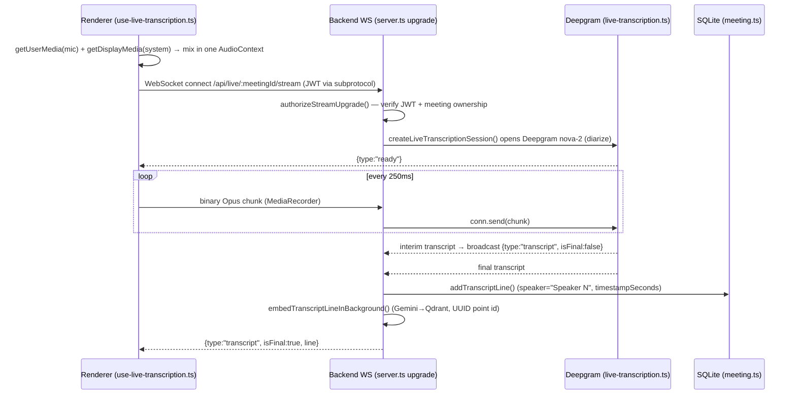

# Architecture — How It Works (Developer Guide)

A map of the system and its end-to-end flows, with the real file paths and
function names so you can navigate the code. For setup see
[`GETTING_STARTED.md`](./GETTING_STARTED.md); for what each phase built see
[`PRODUCTION_HARDENING_IMPLEMENTATION.md`](./PRODUCTION_HARDENING_IMPLEMENTATION.md).

---

## 1. High-level picture

```
┌──────────────────────────┐         ┌───────────────────────────────────────┐
│  Frontend (React/Vite)   │         │  Backend (Express 5 + ws)             │
│  + Electron desktop shell │         │                                       │
│                          │  HTTP   │  routes/  auth, meetings, live,       │
│  features/meeting-copilot│◄───────►│           integrations, intelligence  │
│  contexts/auth-context   │  WS     │  services/ ai, ai-stream, live-       │
│  lib/api-client, config  │◄───────►│           transcription, processing,  │
│                          │         │           embeddings, vector-store,   │
└──────────────────────────┘         │           export, share, slack,       │
        │  system/mic audio           │           enrichment, intelligence    │
        ▼  (renderer capture)         │  connectors/ google (calendar,gmail)  │
   MediaRecorder → WS                 │  lib/ prisma, jwt, ws-auth, enums     │
                                      └───────────────┬───────────────────────┘
                                                      │
     ┌───────────────┬──────────────┬────────────────┼─────────────┬─────────────┐
     ▼               ▼              ▼                 ▼             ▼             ▼
  SQLite         Deepgram         Groq            Gemini        Qdrant       Cloudinary
 (Prisma)       (live STT)   (LLM: summary/     (embeddings)  (vectors/RAG)  (audio/exports)
                              actions/chat)
                                                  Google Calendar / Gmail · Slack · Serper
```

**Backend** — Express 5 REST + a raw `ws` WebSocket for live audio. Entry:
`backend/src/server.ts` (mounts routes, attaches the WS upgrade handler, runs the
fail-fast env check `lib/validate-env.ts`).

**Frontend** — a single-page React app. Almost the entire authenticated UI is one
route (`/dashboard`, plus `/meetings/:id`) rendered by
`features/meeting-copilot/meeting-copilot-app.tsx`, which switches between
"views" (dashboard / live / detail / calendar / device-check / settings / prep)
with local state. Data access goes through `features/meeting-copilot/meetings-api.ts`
and `lib/api-client.ts`.

---

## 2. Data model (`backend/prisma/schema.prisma`, SQLite)

```
User ─┬─< Meeting ─┬─< TranscriptLine
      │            ├─< ActionItem
      │            ├─< MeetingAttendee
      │            ├─< MeetingNote
      │            ├─< MeetingTag
      │            └─< AIChatMessage
      ├─< Integration           (Google Calendar / Gmail OAuth tokens)
      └─< MeetingNote / AIChatMessage
VectorEmbedding   (mirror of Qdrant points: entityId ↔ qdrantId UUID)
IntegrationLog    (audit of email/slack/export shares)
```

SQLite specifics you must respect when touching the schema:
- Scalar lists (`Meeting.keyDecisions/risks/highlights`, `Integration.scopes`)
  are **JSON strings** — read/write via `lib/json-list.ts`.
- Enums are **String** columns; the allowed values live in `lib/enums.ts`
  (derived from the zod schemas in `lib/schemas.ts`).
- API responses run through `serializeMeetingForApi()` (`services/meeting.ts`) so
  clients receive real arrays.

---

## 3. End-to-end flows

### 3.1 Authentication (Google OAuth → JWT)

```
LoginScreen → startGoogleSignIn (lib/google-auth.ts)
   → GET /auth/google           (routes/auth.ts, passport GoogleStrategy)
   → Google consent
   → GET /auth/google/callback  → issues JWT (lib/jwt.ts), redirects to
        /auth/callback?token=…&user=…   (or a desktop deep link)
AuthCallbackScreen → setAuth() → token stored in localStorage ('ai_meeting_token')
```

Every API call attaches `Authorization: Bearer <token>`; `middleware/auth.ts
requireAuth` verifies it and loads `req.user`. Login OAuth and data-integration
OAuth (Calendar/Gmail) are **two separate flows** with separate redirect URIs.

### 3.2 Calendar sync

`SettingsScreen`/`CalendarScreen` → `connectGoogleIntegration` (web popup or
desktop deep-link) → `GET /api/integrations/google/callback` exchanges the code
and `saveIntegration()` (`connectors/google/oauth.ts`) stores tokens on the
`Integration` row. Then `CalendarScreen.fetchCalendarEvents` →
`GET /api/integrations/calendar/events` → `ConnectorManager.getConnector(userId,
'GOOGLE_CALENDAR')` → `GoogleCalendarConnector.listEvents()` (real Google API).

### 3.3 Pre-meeting intelligence

`PreMeetingScreen` → `POST /api/intelligence/pre-meeting`
(`routes/intelligence.ts`) → `services/intelligence.ts buildPreMeetingBrief`:
1. past meetings sharing attendee emails (Prisma),
2. their open action items,
3. an LLM brief via `ai.ts generatePreMeetingBrief` (Groq JSON mode),
4. optional `enrichment.ts enrichPerson` (Serper, gated by `SERPER_API_KEY`).

### 3.4 Live transcription (the WebSocket pipeline)



Capture is **renderer-side** (main process can't use MediaStream APIs). Stop →
close WS + `POST /api/meetings/:id/complete`.

### 3.5 Post-meeting processing

`POST /api/meetings/:id/complete` → `completeMeeting()` sets `PROCESSING` and fires
`services/processing.ts processMeeting()` (async):
1. join transcript → `ai.ts generateMeetingSummary` (summary/decisions/risks/keyPoints)
   and `extractActionItems` — both Groq **JSON mode + zod validate + retry**
   (`lib/llm-json.ts`); bad output → status `FAILED` with `processingError`.
2. write `Meeting` (list fields JSON-serialized) + `createMany` action items.
3. embed summary + each transcript line (`embeddings.ts`, Gemini
   `text-embedding-004`) → store in Qdrant (`vector-store.ts`, **UUID** point ids)
   → mirror to `VectorEmbedding`; set `Meeting.status = COMPLETED`.

### 3.6 RAG chat (streaming)

`askAi` → `meetings-api.ts streamMeetingAnswer` →
`POST /api/live/meetings/:id/ask` (SSE, `routes/live.ts`):
embed the question (Gemini) → `searchTranscripts` in Qdrant (**best-effort**;
falls back to the full transcript if Qdrant/Gemini is down) → stream Groq tokens
via `ai-stream.ts answerMeetingQuestionStream` → persist `AIChatMessage`.

The Live/Detail "Ask AI" box consumes the token stream and appends into the
answer in place.

### 3.7 Sharing & export

- **Export:** `GET /api/meetings/:id/export.md|pdf` → `services/export.ts`
  (`buildMeetingMarkdown` / `buildMeetingPdf` via `pdfkit`). Frontend downloads
  with auth via `downloadMeetingExport`.
- **Email:** `POST /api/meetings/:id/share/email` → `services/share.ts` →
  the user's **Gmail connector** `sendEmail()`; logged to `IntegrationLog`.
- **Slack:** `POST /api/meetings/:id/share/slack` → `services/slack.ts`
  (`chat.postMessage`, app-level `SLACK_BOT_TOKEN`).
The detail screen's `meeting-share-dialog.tsx` drives Email + Slack.

### 3.8 MCP server (agent tool access)

`backend/src/mcp/server.ts` is a standalone stdio MCP server (run with
`pnpm mcp:server`) exposing the Calendar/Gmail tools (`mcp/tools/*`) to external
clients (Claude Desktop/Cursor). The same tools back the in-app agentic
`POST /api/ask-meeting` via `services/ai-agent.ts` (Groq function-calling).

---

## 4. Backend layout (`backend/src`)

| Path | Responsibility |
|------|----------------|
| `server.ts` | app wiring, middleware (helmet, rate-limit, cors, session), **WS upgrade**, startup |
| `routes/` | `auth`, `meetings` (CRUD + notes + search + export + share), `live` (WS-adjacent + SSE ask), `integrations` (Google/Slack), `intelligence` (pre-meeting) |
| `services/` | `ai`, `ai-stream`, `ai-agent`, `live-transcription`, `processing`, `embeddings`, `vector-store`, `transcript-embedding`, `meeting`, `export`, `share`, `slack`, `enrichment`, `intelligence`, `cloudinary` |
| `connectors/` | `connector-manager` + `google/{oauth,calendar,gmail}` |
| `mcp/` | stdio server + tool registry |
| `lib/` | `prisma`, `jwt`, `ws-auth`, `enums`, `json-list`, `llm-json`, `validate-env`, `schemas`, `auth-config`, `passport` |

## 5. Frontend layout (`frontend/src`)

| Path | Responsibility |
|------|----------------|
| `app.tsx` | routes (`/login`, `/auth/*`, `/dashboard`, `/meetings/:id`) |
| `contexts/auth-context.tsx` | auth state + localStorage token + desktop deep-link |
| `features/meeting-copilot/meeting-copilot-app.tsx` | the main SPA shell + view state machine |
| `features/meeting-copilot/*-screen.tsx` | dashboard/live (inline), calendar, device-check, settings, pre-meeting |
| `features/meeting-copilot/meeting-detail/*` | detail screen, share dialog, export bar, audio player |
| `features/meeting-copilot/meetings-api.ts` | typed API client + **adapter** (Prisma shape → UI `Meeting`) |
| `features/meeting-copilot/use-*.ts` | `use-meetings-data`, `use-live-transcription`, device-test hooks |
| `components/brand/` | animated logo mark + branded loader |
| `lib/` | `api-client`, `config` (BACKEND_URL/WS_BASE_URL/TOKEN_KEY), `integrations-api`, `google-auth` |
| `electron/` | main process (windows, tray, deep-link OAuth, loopback permission); **audio capture is renderer-side** |

---

## 6. Conventions & extension points

- **Add a backend feature:** a `service` (pure logic) + a `route` (`requireAuth`,
  validate with a zod schema from `lib/schemas.ts`, return via
  `serializeMeetingForApi` where meetings are involved).
- **Add an integration:** implement a connector under `connectors/`, register it
  in `ConnectorManager`, and surface status in `routes/integrations.ts`.
- **New env var:** add to `.env.example`; if it's required, add it to
  `lib/validate-env.ts` so boot fails clearly without it; if optional, gate the
  feature and report "not configured" (never fabricate).
- **LLM calls that must return JSON:** use `createGroqLLM({ json: true })` +
  `invokeJson(..., schema)` from `lib/llm-json.ts`.
- **Vectors:** never use a cuid as a Qdrant point id — `vector-store.ts` returns a
  UUID; persist it on the entity's `embeddingId` + `VectorEmbedding`.
- **Frontend data:** map API responses to the UI `Meeting` type in
  `meetings-api.ts` rather than changing the UI components' expected shape.

## 7. Verification

`pnpm typecheck` (both packages) and `frontend` `pnpm build` must stay green.
The golden path in `GETTING_STARTED.md` §7 exercises calendar → live transcript →
summary → chat → export/share end to end.
